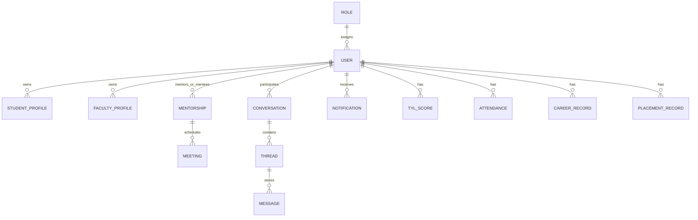

# ER Diagram README

This document gives a quick ER view of Sanghathi and points to the full database model files.

## Primary ER Sources

- docs/database/er/current-schema.mmd
- docs/database/er/current-schema.dbml
- docs/database/er/proposed-schema.mmd
- docs/database/er/proposed-schema.dbml

## High-Level ER (Application View)

## ER Image Placeholders

Upload images in docs/assets/project-report-images and keep these names:

## How to Keep ER Updated

1. Update collection definitions in model files and database docs.
2. Sync docs/database/current-schema.md and docs/database/proposed-schema.md.
3. Regenerate Mermaid/DBML files when structure changes.
4. Replace er-current.png and er-proposed.png with latest exports.
