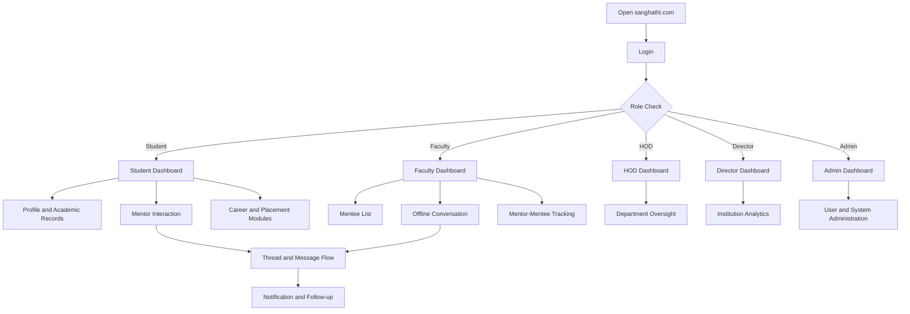
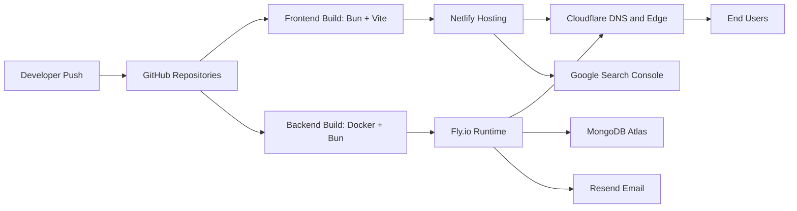

# User Flow and Deployment README

This document explains how users move through the app and how Sanghathi is deployed in production.

## 1. User Flow (Role-Based)

## 2. Deployment Flow

## 3. Deployment Components

- Frontend: Netlify
- Backend: Fly.io runtime with Dockerized Bun-based service
- Database: MongoDB Atlas
- Email: Resend
- Edge and DNS: Cloudflare
- Search and SEO monitoring: Google Search Console

## 4. Image Placeholders

Upload to docs/assets/project-report-images:

